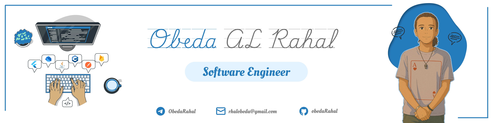

<h1 align="left">Hey there, it's me Obeda Rahal 👋</h1>

---

---

• I am an enthusiastic and driven university student pursuing a degree in Information Engineering. With a strong passion for continuous growth, I actively expand my knowledge through books, online learning, and participation in tech events and competitions.  
• My expertise lies in frontend development and mobile application development with Flutter. I enjoy transforming ideas into functional and visually appealing solutions, always focusing on performance, scalability, and user needs.  
• Throughout my academic journey, I have worked on various projects that not only strengthened my technical background but also enhanced my teamwork, collaboration, and time management skills. These experiences continue to shape me into a well-rounded developer eager to take on new challenges.

---

<h2 align="left">◈ Education 📕</h2>

**Damascus University — B.Sc. in Information Engineering (Software Engineering)**  
*2021 – Present (Expected Graduation: 2026)*  
- Built a solid foundation in software engineering.  
- LEGO robotics course @ Robotics Club (Year 1).  
- Participated in **WRO Syria** as a member of **The Dextrones** team in *RoboMission Senior*.

---

<h2 align="left">◈ Tech Stack 🧰</h2>

<h4 align="left">›› Languages & Frameworks</h4>

  
  
  
  
  
  
  
  
  
  
  
  
  

---

<h4 align="left">›› Code Editors</h4>

  
  
  
  
  
  
  
  
  

---

<h4 align="left">›› Other Tools</h4>

  
  
  
  
  
  
  
  
  
  
  
  
  

---

<h2 align="left">◈ Profile Statistics 🎯</h2>

  
<b>General Statistics</b>

   
  

  
<b>Streak & Activity</b>

   
  
    
  

<h2 align="left">◈ My Repositories 📂</h2>

  
<b>Click to expand</b>

   

  <!-- AUTO-REPOS:START -->
| Repo | Repo | Repo |
| --- | --- | --- |
|  |  |  |
| ⭐ 0 — No description | ⭐ 0 — No description | ⭐ 0 — No description |
|  |  |  |
| ⭐ 0 — this is my third flutter project , This project is for the foruth year, second semester, … | ⭐ 0 — this is my second flutter project , This project is for the third year, second semester, … | ⭐ 0 — this is my first flutter project , This project is for the third year, first semester, of… |
<!-- AUTO-REPOS:END -->

---

<h2 align="left">◈ Profile Trophies 👑</h2>

---

<h2 align="left">◈ My Profiles 📌</h2>

  <!-- Gmail -->
  
  

  <!-- LinkedIn -->
  
  

  <!-- Telegram -->
  
  

  <!-- Facebook -->
  
  

  <!-- Instagram -->
  

---

  
  

<h2 align="left">◈ Contact / CTA 📬</h2>

> Open to Flutter internships, part-time work, and collaboration on frontend & mobile projects.  
> Reach me at **rhalobeda@gmail.com**
